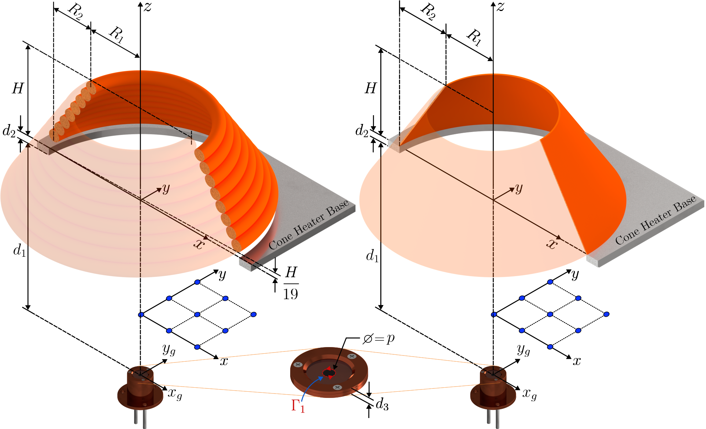

# Cone Calorimeter View Factor

These set of codes calculate the view factor from a target (differential element or a sample surface) to the cone calorimeter heater. If you find this code useful, we kindly ask you to cite our work.

## Version
- **Version**: 1.0.0
- **Release Date**: February 13, 2025
- **Changelog**: 
  - Initial release

## Analysis of Radiative Heat Transfer in Cone Heater Experiments

This repository provides Python scripts for analyzing radiative heat transfer in cone heater experiments, focusing on view factors and irradiance distribution. The code is based on the methodologies detailed in our paper:

> Title: [Investigating radiation heat transfer from the cone calorimeter heater: a new view factor model and uncertainty quantification]  
> Authors: [Pablo E. Pinto](https://orcid.org/0009-0005-2274-9746), [Jorge Valdivia](https://orcid.org/0009-0003-4251-1108), [Abhinandan Singh](https://orcid.org/0000-0002-7995-950X), [Xiuqi Xi](https://orcid.org/0000-0003-3245-232X), [Juan Cuevas](https://orcid.org/0000-0002-1504-5530), [James L. Urban](https://orcid.org/0000-0002-2476-8212)] 
> Journal: [International Journal of Heat and Mass Transfer], [2025].  
> DOI: [https://doi.org/10.2139/ssrn.5085144]

The scripts implement calculations related to view factors, spatial irradiance variations, and experimental data processing, enabling accurate assessment of heat flux distributions in standardized fire testing scenarios. These computations are particularly relevant to tests conducted under ISO 5660 and ASTM E1354, where uniformity of incident radiation is often assumed but requires further scrutiny.

For a comprehensive discussion of the theoretical framework and experimental validation, please refer to the full paper. This repository serves as a practical implementation of the described methodologies.

## Background  

Radiative heat transfer plays a crucial role in fire testing, particularly in cone calorimeter experiments conducted under [**ISO 5660**](https://www.iso.org/standard/57957.html) and [**ASTM E1354**](https://www.astm.org/e1354-23.html). These standards assume a uniform irradiance distribution over the specimen surface, but in practice, spatial variations can occur due to geometric and optical factors.  

A **cone heater** is commonly used to provide a controlled heat flux to a sample, simulating fire exposure conditions. The distribution of irradiance on the specimen is influenced by the **view factor**, which accounts for the geometric relationship between the heater and the sample. Deviations from uniformity can lead to inaccuracies in heat flux measurements, material degradation analysis, and fire modeling efforts.  

This repository provides tools for computing **view factors** and analyzing the spatial distribution of irradiance in cone heater setups. The implemented algorithms enable precise quantification of heat flux variations, supporting a more rigorous interpretation of experimental results.  

For a detailed theoretical discussion, derivations, and experimental validation, refer to the associated publication. 

## Installation & Usage  

### Requirements  
This code requires Python 3 and the following dependencies:  

- `numpy`  
- `scipy` (for numerical integration)  

Ensure these are installed using:  

```bash
pip install numpy scipy
```
## Schematic Representation & Description of Scripts  

The figure below illustrates the experimental setup and dimensions for the cone calorimeter heater, showing two idealized geometries: a **helical coil (HC)** arrangement (left) and a **truncated cone (TC)** (right). The constants are defined as $R_1 = R_2 = 40$ mm and $H = 65$ mm, following the [ISO 5660](https://www.iso.org/standard/57957.html) standard. The key parameters used in the calculations are also shown.  

  
*Figure 1: Schematic of the experimental setup and dimensions for the cone calorimeter heater (not to scale), illustrating two idealized geometries: a helical coil arrangement (left) and a truncated cone (right).*  

### View Factor Computation  

This repository contains four Python scripts for computing the **view factor (VF)** in the cone heater setup:  

- **`VF_dA_to_HC.py`** – Computes the view factor from a **differential element** (disk of diameter $p$) to the **helical coil (HC)** representation of the heater.  
- **`VF_dA_to_TC.py`** – Computes the view factor from a **differential element** (disk of diameter $p$) to the **truncated cone (TC)** representation of the heater.  
- **`VF_sample_to_HC.py`** – Computes the view factor from a **square sample** of side length $p$ to the **helical coil (HC)**.  
- **`VF_sample_to_TC.py`** – Computes the view factor from a **square sample** of side length $p$ to the **truncated cone (TC)**.  

### Parameters  

- **For `VF_dA_to_HC.py` and `VF_dA_to_TC.py` (Differential Element, $dA$ to HC or TC)**:  
  - $h, k$: $(x,y)$ coordinates of the center of the differential element. In Fig. 1: $(h,k)=(x_g,y_g)$.
  - $d$: Vertical distance from the cone heater to the differential element. **Note that you should account for the 5 mm thickness of the plate, $d_2$, in the calculation so that $d=d_1+d_2$** (see Fig. 1). For example, at the standard distance of $d_1=25$ mm, in the view factor calculation: $d=d_1+d_2 =30$ mm. 
  - $p$: Diameter of the differential element (in mm).

- **For `VF_sample_to_HC.py` and `VF_sample_to_TC.py` (Sample to HC or TC)**:  
  - $d$: Vertical distance from the cone heater to the sample ($d = d_1$).  
  - $p$: Side length of the square sample (in mm).  

These parameters, as illustrated in the schematic, define the spatial configuration for computing the view factors.  

#### Example: Calculating the View Factor

1. This example calculates the **View Factor** from a **differential element** (a small disk of diameter $p=10^{-5}$ mm) at $(h,k)=(0,0)$, positioned at the **standard distance** $d_1=25$ mm, to the Helical Coil (HC).
The corresponding Python script: **VF_dA_to_HC.py**
```python
d1 = 25       # in mm; standard distance
d2 = 5        # in mm; cone base plate thickness
d  = d1 + d2  
p  = 10**(-5) # in mm; diameter of the disk (differential element)
h, k = 0, 0   # in mm; central location of the disk (differential element)

VF = VF_dA_to_HC(h,k,d,p)
print(f'The View Factor is: {VF:.4f}')
```

Example output
```pgsql
The View Factor is: 0.6690
```

2. This example calculates the **View Factor** from a **standard square sample** with side length $p = 100$ mm, at a **standard distance** $d_1 = 25$ mm to the **Helical Coil** (HC).

The corresponding Python script: **`VF_sample_to_HC.py`**
```python
d1 = 25       # in mm; standard distance
d2 = 5        # in mm; cone base plate thickness
d  = d1 + d2 
p = 100       # in mm; side length of the sample (for each side of the square)

VF = VF_sample_HC(d,p)
print(f'The View Factor is: {VF:.4f}')
```

Example output
```pgsql
The View Factor is: 0.6216
```

## Mathematical formulation

### Radiative heat flux
The incident radiation to the target, represented by the heat flux gauge sensor area and denoted as $`\dot{q}_{inc,g}^{\prime\prime}`$, is related to the power emitted from the cone heater, $\dot{q}_{emi,c}$, by the following expression:
```math
\dot{q}_{emi,c}\,F_{c\rightarrow {g}}=A_g\,\dot{q}_{inc,g}^{\prime\prime}
```

Here, $`F_{c\rightarrow {g}}`$ is the view factor from the cone heater to the gauge's sensor. By applying the reciprocity rule of view factors, $`A_{c}F_{c\rightarrow{g}}=A_{g}F_{g\rightarrow{c}}`$, the previous equation can be rearranged to express $`\dot{q}^{\prime\prime}_{inc,g}`$:
```math
\dot{q}^{\prime\prime}_{inc,g}=F_{g\rightarrow{c}}\dot{q}^{\prime\prime}_{emi,c}=F_{g\rightarrow{c}}\varepsilon_c \sigma T_c^{4}
```

In this equation, $`F_{g \rightarrow{c}}`$ is the view factor from the gauge's sensor ($g$) to the cone heater ($c$), while $\varepsilon_c$ denotes the emissivity of the cone heater surface, $\sigma$ is the Stefan-Boltzmann constant, and $T_c$ is the temperature of the cone heater. 

### View factor definition
The view factor between two finite surfaces, $A_{i}$ and $A_{j}$, can be calculated mathematically from their contours $`\Gamma_{i}`$ and $`\Gamma_{j}`$, respectively, by applying Stokes' theorem twice to the view factor definition (given by the surface integrals):
```math
F_{{i}\rightarrow{{j}}}=\dfrac{1}{2\pi A_{i}}\oint_{\Gamma_{j}}\oint_{\Gamma_{i}}\ln(R_{ij})\,d\boldsymbol{r}_{i}d\boldsymbol{r}_{j}
```

Here, $`R_{ij}`$ represents the Euclidean distance between the contours defined by the positions $`\boldsymbol{r}_{i}`$ and $`\boldsymbol{r}_{j}`$, respectively. This contour methodology is utilized to determine the view factor between the cone heater and targets (e.g., radiometer or small patch of a sample surface) positioned at various locations from the cone heater.

This work focuses on calculating the view factor between a differential element, $dA$, a square sample of side length $L$, or a heat flux gauge sensor (disk) and the cone calorimeter heater. For a detailed derivation of the model, the reader is encouraged to refer to the paper.

